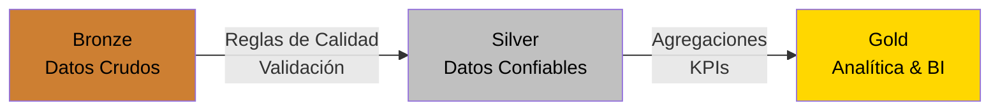

# 📊 Gobierno de Datos – KPIs de Servicio Ciudadano

## 1. Objetivo
Este documento define el **marco de Gobierno de Datos**, KPIs oficiales, diccionarios de datos y lineage detallado
para la analítica de solicitudes ciudadanas bajo arquitectura **Medallón (Bronze → Silver → Gold)**.

---

## 2. Tarjetas de KPIs Oficiales (Capa Gold)

### KPI 1 – Volumen de Solicitudes
- **Nombre:** Total Requests
- **Fórmula:** `COUNT(request_id)`
- **Owner:** Gerencia de Atención Ciudadana
- **Frecuencia:** Mensual
- **Fuente:** Gold – `kpis_servicio_ciudadano`
- **Umbral / Alerta:** 🔴 Variación > ±20% vs promedio 3 meses
- **Uso de negocio:** Planeación de recursos y carga operativa

---

### KPI 2 – Solicitudes Cerradas
- **Nombre:** Closed Requests
- **Fórmula:** `SUM(is_closed)`
- **Owner:** Oficina Responsable
- **Frecuencia:** Mensual
- **Fuente:** Gold
- **Umbral / Alerta:** 🔴 <85% del total
- **Uso de negocio:** Seguimiento de eficiencia

---

### KPI 3 – % Solicitudes Cerradas
- **Nombre:** Percentage Closed
- **Fórmula:** `(closed_requests / total_requests) * 100`
- **Owner:** PMO / Calidad
- **Frecuencia:** Mensual
- **Fuente:** Gold
- **Umbral / Alerta:** 🔴 <90%
- **Uso de negocio:** Control de cumplimiento operativo

---

### KPI 4 – Tiempo Promedio de Resolución
- **Nombre:** Avg Resolution Hours
- **Fórmula:** `AVG(resolution_hours)`
- **Owner:** Oficina Responsable
- **Frecuencia:** Mensual
- **Fuente:** Gold
- **Umbral / Alerta:** 🔴 >72 horas
- **Uso de negocio:** Gestión de SLA

---

### KPI 5 – Satisfacción Promedio
- **Nombre:** Avg Satisfaction
- **Fórmula:** `AVG(satisfaction_rating)`
- **Owner:** Experiencia Ciudadana
- **Frecuencia:** Mensual
- **Fuente:** Gold
- **Umbral / Alerta:** 🔴 <3.5
- **Uso de negocio:** Mejora de experiencia del ciudadano

---

### KPI 6 – % Digital
- **Nombre:** Digital Adoption Rate
- **Fórmula:** `(digital_requests / total_requests) * 100`
- **Owner:** Transformación Digital
- **Frecuencia:** Mensual
- **Fuente:** Gold
- **Umbral / Alerta:** 🔴 <50%
- **Uso de negocio:** Medición de digitalización

---

## 3. Data Dictionary – Capa Bronze

### Tabla: solicitudes_ciudadanas
| Campo | Tipo | Descripción |
|-----|-----|------------|
| request_id | STRING | Identificador único de solicitud |
| citizen_id | STRING | Identificador del ciudadano |
| office_id | STRING | Oficina receptora |
| channel | STRING | Canal de atención |
| request_type | STRING | Tipo de solicitud |
| category | STRING | Categoría principal |
| subcategory | STRING | Subcategoría |
| created_at | TIMESTAMP | Fecha de creación |
| closed_at | TIMESTAMP | Fecha de cierre |
| status | STRING | Estado |
| satisfaction_rating | INT | Satisfacción (1–5) |
| resolution_hours | DECIMAL | Horas declaradas |
| cost_soles | DECIMAL | Costo del trámite |
| latitude / longitude | DECIMAL | Geolocalización |
| contact_email | STRING | Email de contacto |
| contact_phone | STRING | Teléfono |

---

## 4. Data Dictionary – Capa Silver (solicitudes_clean)

### Transformaciones clave
- Eliminación de duplicados (`request_id`)
- Validación de estados y canales
- Normalización de categorías
- Corrección de fechas inconsistentes
- Cálculo de `resolution_hours`
- Enmascaramiento / eliminación de PII innecesaria

| Campo | Tipo | Descripción |
|-----|-----|------------|
| request_id | STRING | Clave única validada |
| office_id | STRING | Oficina válida |
| channel | STRING | Canal normalizado |
| category | STRING | Categoría validada |
| created_at | TIMESTAMP | Fecha válida |
| closed_at | TIMESTAMP | Fecha válida |
| status | STRING | Estado controlado |
| resolution_hours | DECIMAL | Calculado |
| satisfaction_rating | INT | Validado (1–5) |
| cost_soles | DECIMAL | Costo |
| latitude / longitude | DECIMAL | Coordenadas válidas |

---

## 5. Data Dictionary – Capa Gold (kpis_servicio_ciudadano)

| Campo | Tipo | Descripción |
|-----|-----|------------|
| office_id | STRING | Oficina |
| period_year | INT | Año |
| period_month | INT | Mes |
| period_start | DATE | Inicio de mes |
| total_requests | INT | Total solicitudes |
| closed_requests | INT | Cerradas |
| cancelled_requests | INT | Anuladas |
| digital_requests | INT | Digitales |
| avg_resolution_hours | DECIMAL | Promedio |
| avg_cost_soles | DECIMAL | Costo promedio |
| avg_satisfaction | DECIMAL | Satisfacción |
| pct_closed | DECIMAL | % cerradas |
| pct_cancelled | DECIMAL | % anuladas |
| pct_digital | DECIMAL | % digital |
| top_category | STRING | Categoría dominante |

---

## 6. Lineage Detallado

### Nivel Técnico
- **Bronze:** ingestión CSV sin reglas
- **Silver:** reglas de calidad, logs de validación, normalización
- **Gold:** agregaciones, KPIs, métricas de negocio

### Nivel de Negocio
- Solicitudes → Atención → Resolución → Experiencia Ciudadana

### Nivel de Gobierno
- Owners definidos
- Métricas auditables
- Calidad medible por ejecución
- Trazabilidad completa por campo

---

## 7. Arquitectura Medallón

---

## 8. Beneficios Clave
- KPIs oficiales y gobernados
- Diccionario de datos completo
- Lineage transparente
- Preparado para BI, auditoría y Data Mesh
